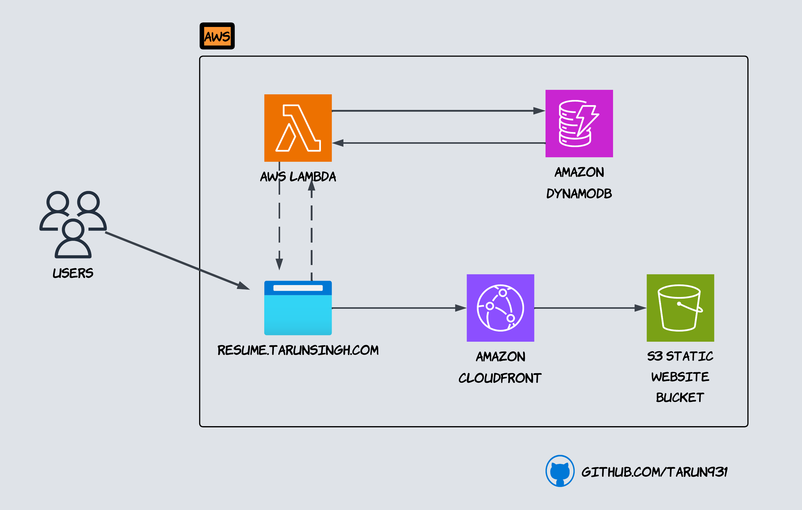

# ☁️ AWS Cloud Resume Challenge

## 🚀 Upload Website Project

This is my personal implementation of the **Cloud Resume Challenge** on AWS.

> **What is the Cloud Resume Challenge?**  
> The Cloud Resume Challenge is a multi-step, real-world cloud project designed by [Forrest Brazeal](https://cloudresumechallenge.dev/).  
> It helps you gain hands-on experience with AWS services, infrastructure-as-code, CI/CD, and more — all while building your resume as a live website!

---

## 🖼️ Architecture Diagram

---

## 🧰 Services Used

- 🗂️ **Amazon S3** – Hosts the static resume website (HTML, CSS, JS)  
- 🌐 **AWS CloudFront** – Distributes the site globally with CDN and HTTPS  
- 🧠 **AWS Lambda** – Serverless function for view counter logic  
- 🧾 **Amazon DynamoDB** – NoSQL database for storing view counts  
- 🤖 **GitHub Actions** – Automates CI/CD deployment to S3 and CloudFront

---

Stay tuned — I'm still adding features like HTTPS with a custom domain, monitoring, and infrastructure-as-code with Terraform! 🛠️

